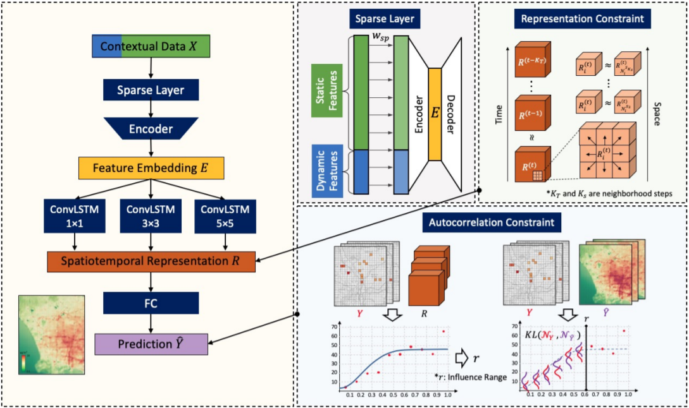

# Building Autocorrelation-Aware Rerpresentations for Fine-Scale Spatiotemporal Prediction
Y. Lin, Y. -Y. Chiang, M. Franklin, S. P. Eckel and J. L. Ambite, "Building Autocorrelation-Aware Representations for Fine-Scale Spatiotemporal Prediction," 2020 IEEE International Conference on Data Mining (ICDM), 2020, pp. 352-361, doi: [10.1109/ICDM50108.2020.00044.](https://ieeexplore.ieee.org/document/9338402)
<!-- 

## [Updates]
* Oct. 18th 2021, the final organized DeepLatte code has been published.
 -->
## Requirements
* See torch-env.yml under env folder.

## Datasets
Sample data is available at: sample_data/los_angeles_500m_2020_02.npz contains feature values
* dynamic_feature_names (list): list of dynamic features, such as 'temperature', 'dew_point', 'humidity', etc.
* static_feature_names (list): list of static features, such as 'landuse_a_allotments', 'landuse_a_military', etc.
* mapping_map (ndarray): (Height, Width) array of the pixels

## Running the code

**You can find a more detail in "*python train.py -h"**

>Required information:
>- [--data_path DATA_PATH] 
>- [--result_dir RESULT_DIR] 
>- [--model_dir MODEL_DIR] 
>- [--model_name MODEL_NAME] 
>- [--model_types MODEL_TYPES] 
>- [--device DEVICE]
>- [--num_epochs NUM_EPOCHS] 
>- [--batch_size BATCH_SIZE] 
>- [--lr LR] 
>- [--weight_decay WEIGHT_DECAY] 
>- [--patience PATIENCE] 
>- [--seq_len SEQ_LEN]
>- [--en_features EN_FEATURES] 
>- [--de_features DE_FEATURES] 
>- [--kernel_sizes KERNEL_SIZES] 
>- [--h_channels H_CHANNELS] 
>- [--fc_h_features FC_H_FEATURES]
>- [--sp_neighbor SP_NEIGHBOR] 
>- [--tp_neighbor TP_NEIGHBOR] 
>- [--alpha ALPHA] 
>- [--beta BETA] 
>- [--gamma GAMMA] 
>- [--eta ETA] 
>- [--use_tb] 
>- [--tb_path TB_PATH] 
>- [--verbose]

## Data format
The input includes the contextual data and the available measurements in a grid structure (tensors).
The contextual data is a single array of shape **H x W x P**, where **P** is the number of input features, **H** and **W** are the height and width of the grid. 
Each input represents the input signal at time **i**, and **T'** is the number of previous hours (from **t - T' + 1** to **t**).

## Code
### Code structure
* The PyTorch implementation of DeepLatte architecture is located in the models folder
* The folder models contains autoencoder, convlstm, and linear layers with other utilites
* DeepLatte model contains two high-level python scripts at train.py and test.py

<!-- ### Folder structure
- sample_data
  - results
  - toy version data
- models
  - autoencoder
  - convlstm
  - deeplatte
  - linear_layers
  - st_losses
  - svg_losses
- scripts
  - data_loader
- train
- test -->

<!-- ### Re-use
* The main component (DeepLatte.py) is implemented as stand-alone pytorch nn.Modules and it can be re-used in other application.
* convLSTM contains a tensor as (height, width), number of channels in the input image, number of channels of hidden state, and size of the convolution kernel; Input is: *(batch_size, seq_len, num_channels, height, width)*.
* autoencoder exploits a vallina auto-encoder, which only includes one hidden layer. 
* linear_layers uses L1 regularization for feature selection, thus input and output features in param must be the in_features. 
 -->
## Reference
* ConvLSTM has been reproduced in DeepLatte following by ConvLSTM.pytorch (Ref: https://github.com/spacejake/convLSTM.pytorch/blob/master/convlstm.py).

